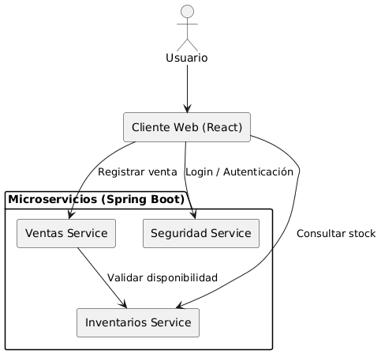
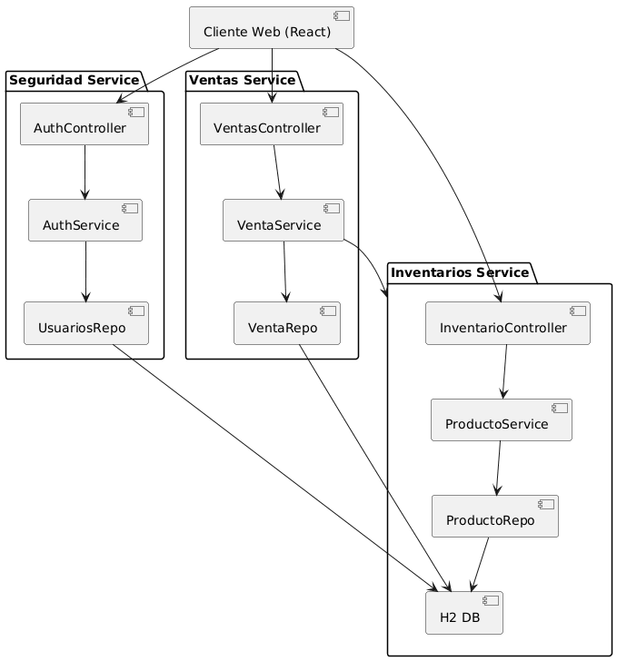
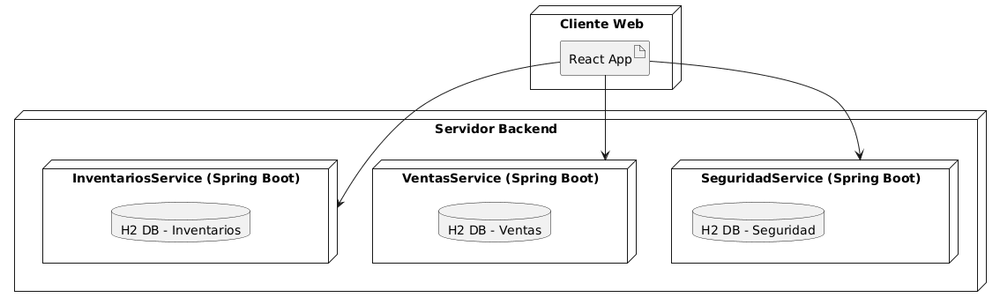
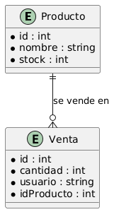

# ERP - Prueba de Concepto

Este proyecto es una **prueba de concepto (PoC)** de un sistema ERP modular con arquitectura de **microservicios**.  
Los microservicios están desarrollados en **Spring Boot**, mientras que el cliente está construido en **React** con Material-UI.  

La PoC permite:
- Registrar ventas desde una interfaz web.
- Validar stock en inventario al vender.
- Mostrar el historial de ventas realizadas.

---

## Diagramas de la arquitectura

La solución está basada en arquitectura de **microservicios**.  
Entre los diagramas diseñados se encuentran:

- **Diagrama de contexto**



- **Diagrama de componentes**  


- **Diagrama de despliegue**  



- **Diagrama ER**



---

## Requerimientos

Antes de ejecutar, asegúrate de tener instalado:

- **Java 17 o superior**  
- **Maven 3.9+**  
- **Node.js 18+ y NPM 9+**

---

## Instrucciones de ejecución

### 1. Clonar el repositorio
```bash
git clone https://github.com/Mulansito-l/ERP-POC.git
cd ERP-POC
```
### 2. Ejecutar todos los servicios por separado (en diferentes terminales)
```bash
cd inventarios-service
mvn clean spring-boot:run

cd ventas-service
mvn clean spring-boot:run

cd seguridad-service
mvn clean spring-boot:run

cd frontend-react
npm install
npm start
```

### 3. Acceder a la aplicación de React en el puerto 3000

http://localhost:3000